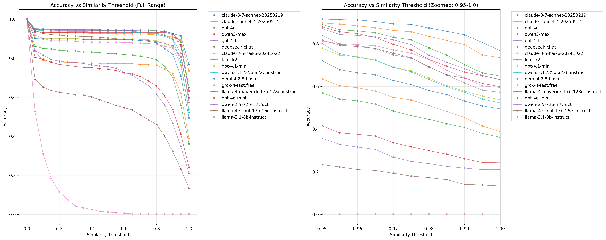

# Base64Bench - base64 {en,de}coding evaluation

This benchmark provides an evaluation framework to assess how well different AI models can handle base64 encoding and decoding tasks across diverse input types.

## What This Benchmark Tests

This benchmark evaluates AI models' ability to perform accurate base64 encoding and decoding operations. The evaluation focuses on testing this core capability across a wide range of text inputs.

### Core Capabilities
- **Encoding Tasks**: Converting plain text strings to their base64 representations
- **Decoding Tasks**: Converting base64 strings back to their original plain text
- **Accuracy Measurement**: Using normalized Levenshtein similarity to assess output quality

### Input Diversity
The benchmark tests models across a comprehensive range of input types:
- **Identifiers**: UUIDs, API keys, access tokens
- **Cryptographic Data**: Sanitized* representations of SSH keys and certificates
- **Structured Data**: JSON objects, XML fragments, CSV data
- **Natural Language**: English paragraphs of varying lengths
- **Technical Content**: File paths, shell commands, error messages
- **Edge Cases**: Special characters, mixed-case text, etc.
- **Variable-Length Data**: Base64 blobs from medium (≈800 chars) to long (≈3200+ chars)

*We need sanitized versions of sensitive data (e.g. SSH keys) because model refusals happen semi-regularly when dealing with real-looking data.

## Setup and Architecture

### Framework and Dependencies
The benchmark is built using the [Inspect AI](https://github.com/UKGovernmentBEIS/inspect_ai) evaluation framework and includes:
- **Task Definition**: Structured evaluation tasks for encoding and decoding operations
- **Dataset Generation**: Configurable generation of diverse test inputs using cryptographically secure randomness
- **Scoring System**: Normalized Levenshtein similarity scoring with configurable thresholds
- **Analysis Tools**: Comprehensive result analysis with statistical reporting and visualization

### Dataset Structure
The evaluation dataset is provided in JSONL format, where each sample contains:
```json
{"text": "Hello, World!", "type": "common_word"}
```

### Evaluation Process
1. **Bidirectional Testing**: Each text sample undergoes both encoding and decoding evaluation
2. **Clean Prompts**: Models receive minimal, unambiguous instructions without examples or reasoning guidance
3. **Strict Output Requirements**: Responses must contain only the encoded/decoded result
4. **Similarity Scoring**: Results are scored using normalized Levenshtein distance, providing granular performance measurement beyond binary pass/fail

### Model Performance Analysis

The benchmark provides detailed analysis across multiple dimensions:



The threshold sweep analysis demonstrates model performance across different similarity acceptance levels, revealing how accuracy varies with evaluation strictness. This visualization shows the trade-off between precision and recall, helping identify optimal evaluation thresholds for different use cases.

### Key Metrics
- **Accuracy at Threshold 1.0**: Percentage of perfect matches (similarity = 1.0)
- **Accuracy at Threshold 0.9**: Percentage of near-perfect matches (similarity ≥ 0.9)
- **Average Similarity**: Mean similarity scores across all samples
- **Task-Specific Performance**: Separate metrics for encoding vs. decoding tasks
- **Data Type Analysis**: Performance breakdown by input type (UUIDs, text, keys, etc.)

### Running the Benchmark

```bash
# Install dependencies
uv sync

# Generate dataset if desired (10 samples of each type)
uv run python generate_dataset.py -o dataset.jsonl -n 10

# Run evaluation on specific models
inspect eval base_64_bench.py@base_64_bench \
    --model anthropic/claude-3-5-sonnet-20241022,openai/gpt-4o \
    --log-dir ./logs/ \
    -T threshold=1.0 \
    -T dataset_path=dataset.jsonl

# Analyze results
uv run python analyse_results.py --logs-dir ./logs/
```

### Analysis Output
The analysis generates:
- **Performance Summary**: CSV file with per-model accuracy metrics
- **Threshold Analysis**: Performance across different similarity thresholds
- **Data Type Breakdown**: Accuracy by input category
- **Task Comparison**: Encoding vs. decoding performance analysis
- **Statistical Visualizations**: Distribution plots and performance comparisons
